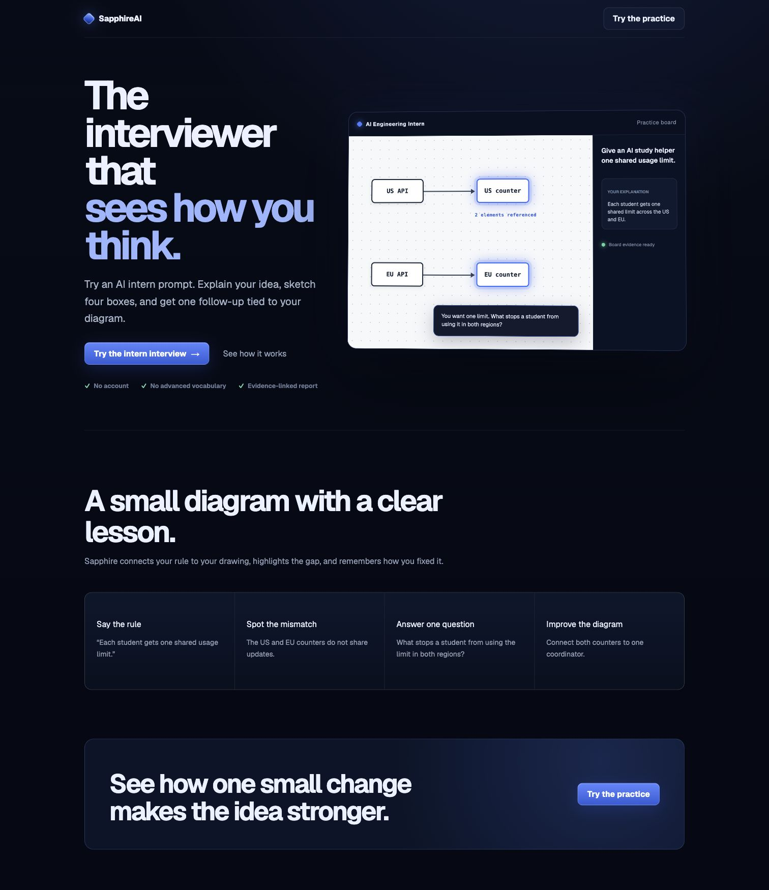

# SapphireAI

**The interviewer that sees how you think.**

SapphireAI is a whiteboard-native interview-practice application. It compares a candidate’s observable spoken or typed reasoning with an evolving system-design board, focuses the exact board elements that support a mismatch, and asks one evidence-grounded follow-up.

## A beginner-friendly demo

Imagine you are practicing for an AI engineering internship. The interviewer asks you to give an AI study helper one shared usage limit: every student may receive 10 answers per minute total, whether they use the US or EU service.

You explain the rule, then draw one counter in each region. Sapphire notices that the counters do not exchange updates, highlights those exact two boxes, and asks what stops a student from using the full limit in both regions. You connect both counters to one coordinator, and the report preserves the claim, mismatch, question, and revision.

This internship prompt is one approachable example of the whiteboard interaction, not a job-matching or multi-role platform.

<table>
  <tr>
    <td width="50%">
      
       <strong>Exact contradiction focus:</strong> only the two unsupported regional counters are selected.
    </td>
    <td width="50%">
      
       <strong>Evidence-linked report:</strong> the full claim, probe, and revision remain inspectable.
    </td>
  </tr>
</table>

Under the friendly wording, the flagship acceptance test is still a distributed rate limiter. Sapphire must preserve the shared-limit claim, identify the missing coordination path, focus the exact stable element IDs, ask what prevents double consumption, recognize the coordination revision, and replay that evidence in the final report.

> **Current status:** the complete deterministic flagship flow is implemented and verified locally and through the private Cloud Run deployment. The deployed journey exercised Firestore and Cloud Storage, including deletion. Real Gemini authorization reaches `gemini-3.5-flash`, but the final smoke received retryable provider-capacity errors rather than a validated analysis. Browser Live audio is not implemented, and there is intentionally no public deployment.

## Product boundaries

SapphireAI is a learning and interview-practice product. It evaluates only observable artifacts: finalized speech/text, whiteboard shapes and connections, stated assumptions, revisions, and responses to constraints.

It does not infer private chain of thought, emotion, personality, accent quality, facial expression, protected traits, or culture fit. It does not make hiring decisions. The hackathon MVP intentionally excludes resumes, job matching, user accounts, payments, employer dashboards, and generic chat.

## Architecture

~~~mermaid
flowchart LR
    Candidate["Candidate speech, text, and board"]
    Live["Target Live interviewer 3.1 Flash Live Preview"]
    App["Next.js browser + server"]
    Orchestrator["Application-owned orchestrator"]
    Reasoning["Gemini 3.5 Flash Interactions API"]
    Stores["Memory or Firestore Private snapshot storage"]

    Candidate --> App
    Candidate --> Live
    Live <-->|"ephemeral token + tools"| App
    App --> Orchestrator
    Orchestrator --> Reasoning
    Orchestrator --> Stores
    Reasoning -->|"validated state + exact IDs"| Orchestrator
    Orchestrator -->|"focus, probe, report, replay"| App
~~~

Gemini interprets multimodal evidence. Deterministic application code owns permissions, stable IDs, schema validation, confidence policy, state transitions, persistence, rendering, and deletion. See [docs/ARCHITECTURE.md](docs/ARCHITECTURE.md) for the complete flows.

The current browser runtime uses typed reasoning plus direct board analysis. The server token route, strict Live tools, dispatcher, and recovery reducer exist as a P1 foundation, but a concrete browser Live WebSocket/audio transport is not wired.

## Prerequisites

- Node.js 24 LTS
- pnpm 11 or a compatible current pnpm release
- A Chromium-based browser for the interview room
- No cloud credential for local deterministic mock mode
- An approved server-side Gemini credential for real reasoning or Live tests
- Google Cloud CLI and an explicitly approved project only for deployment; the verified environment uses the non-billable Google Cloud Free Trial and must not be upgraded with **Activate**

## Local setup

~~~bash
pnpm install
cp .env.example .env.local
pnpm dev
~~~

Open the URL printed by Next.js, normally [http://localhost:3000](http://localhost:3000).

The checked-in `.env.example` is safe to copy. Replace its signing-secret placeholder with a local value of at least 32 characters. A local `.env.local` is ignored by Git and should never be committed.

### Deterministic mock mode

Use mock mode for local development and automated tests:

~~~dotenv
GEMINI_MODE=mock
ENABLE_GEMINI_LIVE=false
ENABLE_FIRESTORE=false
ENABLE_CLOUD_STORAGE=false
APP_BASE_URL=http://localhost:3000
SESSION_SIGNING_SECRET=replace-with-a-long-random-local-value
~~~

The interface visibly identifies mock mode. The deterministic fixture covers the shared-limit claim, isolated US/EU counters, exact element focus, a coordination revision, and evidence-linked report data. It uses no Gemini calls, cloud credentials, or billable Google Cloud services.

### Real Gemini mode

Use a server-side credential only:

~~~dotenv
GEMINI_API_KEY=provided-outside-source-control
GEMINI_REASONING_MODEL=gemini-3.5-flash
GEMINI_LIVE_MODEL=gemini-3.1-flash-live-preview
GEMINI_MODE=real
ENABLE_GEMINI_LIVE=false
~~~

Never use a `NEXT_PUBLIC_` prefix for credentials. Explicit real mode must fail with an actionable server error if authorization is absent; it must not silently fall back to mock mode.

The reasoning path uses the GA Gemini 3.5 Flash model through the current Interactions API. A future voice transport is designed to use the Preview Gemini Live API with short-lived constrained ephemeral tokens; only its token/tool/state foundation is currently implemented. Exact request shapes and official references are in [docs/GEMINI_USAGE.md](docs/GEMINI_USAGE.md).

## Environment variables

| Variable | Purpose | Secret |
| --- | --- | --- |
| `GEMINI_API_KEY` | Server authorization for Gemini reasoning and ephemeral-token creation | Yes |
| `GEMINI_REASONING_MODEL` | Defaults to `gemini-3.5-flash` | No |
| `GEMINI_LIVE_MODEL` | Defaults to `gemini-3.1-flash-live-preview` | No |
| `GEMINI_MODE` | Explicit `real` or `mock` provider selection | No |
| `ENABLE_GEMINI_LIVE` | Enables the Preview Live path | No |
| `ENABLE_FIRESTORE` | Selects durable structured persistence | No |
| `ENABLE_CLOUD_STORAGE` | Selects private snapshot object storage | No |
| `GOOGLE_CLOUD_PROJECT` | Google Cloud project ID | No |
| `GOOGLE_CLOUD_REGION` | Cloud Run/bucket region, normally `us-central1` | No |
| `FIRESTORE_DATABASE_ID` | Firestore database, normally `(default)` | No |
| `GCS_BUCKET` | Private snapshot bucket | No |
| `APP_BASE_URL` | Canonical application origin | No |
| `SESSION_SIGNING_SECRET` | Signs/digests anonymous ownership capabilities | Yes |

Environment validation should report missing variable names without printing their values.

## Checks

Run the relevant complete set before claiming a milestone:

~~~bash
pnpm lint
pnpm typecheck
pnpm test
pnpm test:e2e
pnpm build
pnpm audit --prod --audit-level high
~~~

The deterministic Playwright journey must cover the entire rate-limiter sequence, including exact highlights, revision recognition, report, replay, deletion, and subsequent not-found. Real Gemini and Live smoke tests are opt-in and must not run automatically without authorization.

After UI changes, verify the rendered journey and record actual results, console/network observations, browser details, and screenshots in [docs/QA_REPORT.md](docs/QA_REPORT.md).

Current local evidence:

- `pnpm lint`: passed
- `pnpm typecheck`: passed
- `pnpm test`: 71 tests passed
- `pnpm test:e2e`: 2 Playwright journeys passed
- `pnpm build`: passed
- `pnpm audit --prod --audit-level high`: passed with no known production vulnerabilities

## Container and Cloud Run

The root [Dockerfile](Dockerfile) is a Node.js 24 multi-stage build for Next.js standalone output and runs as a non-root user on Cloud Run’s injected `PORT`.

The deployment helper is intentionally non-mutating by default:

~~~bash
bash scripts/deploy-cloud-run.sh plan
bash scripts/deploy-cloud-run.sh preflight
~~~

It does not enable APIs, create databases/buckets/service accounts/secrets, change IAM, expose a service, or deploy unless the operator separately prepares those resources and supplies the explicit deployment confirmation. The verified service is `sapphireai` in `us-central1`, uses scale-to-zero with a one-instance ceiling, and remains private. Read [docs/GOOGLE_CLOUD.md](docs/GOOGLE_CLOUD.md) before any cloud action.

## Google Cloud responsibilities

- **Cloud Run:** complete Next.js application and server APIs
- **Firestore:** sessions, ordered evidence events, finalized transcripts, normalized scenes, reasoning state, and reports
- **Cloud Storage:** selected board snapshots only; private and not publicly listable
- **Secret Manager:** permanent Gemini authorization and session-signing secret
- **Cloud Logging:** structured stdout/stderr metadata without secret or raw private content
- **Artifact Registry and Cloud Build:** reproducible container build path when approved

Local mock mode uses the same repository and gateway interfaces with memory implementations, so missing cloud access does not block P0.

## Privacy and safety

- Explicit consent precedes transcript persistence and microphone use.
- Raw microphone audio is not stored by default.
- Only finalized transcripts and selected meaningful board snapshots are retained.
- Snapshot access is ownership-authorized; the bucket remains private.
- Model output is validated and rendered as text, never trusted HTML.
- Unknown board IDs are rejected.
- Users can delete the entire anonymous session and its artifacts.
- Logs omit secrets, raw provider payloads, full transcripts, and board image bytes.

See [docs/PRIVACY.md](docs/PRIVACY.md) for data handling, retention limitations, and deletion behavior.

## Documentation

- [Implementation plan](docs/IMPLEMENTATION_PLAN.md)
- [Architecture](docs/ARCHITECTURE.md)
- [Gemini usage](docs/GEMINI_USAGE.md)
- [Google Cloud runbook](docs/GOOGLE_CLOUD.md)
- [Privacy](docs/PRIVACY.md)
- [QA evidence](docs/QA_REPORT.md)

## Known limitations

- The real Gemini credential and request path are verified, but the final `gemini-3.5-flash` smokes did not return a usable reasoning result: one bounded run received transient HTTP 500 provider-capacity responses, and a later bounded run received HTTP 429 Free Tier rate-limit responses.
- Gemini Live and its selected model are Preview. Token minting, strict tools, dispatch, and recovery state exist, but microphone capture, browser transport, playback, transcription bridging, and networked reconnect are not implemented.
- Firestore and Cloud Storage were exercised through the private deployed flagship journey; automatic time-based session retention is not yet implemented.
- The container image and Cloud Run revision were built and verified with Cloud Build because a local container engine is unavailable.
- The Cloud Run service is deliberately private. Public invocation has not been approved or enabled, so the canonical service URL is not a public demo link.
- The MVP intentionally contains one deep, beginner-friendly AI internship practice scenario. Multiple roles are outside the current product scope.
