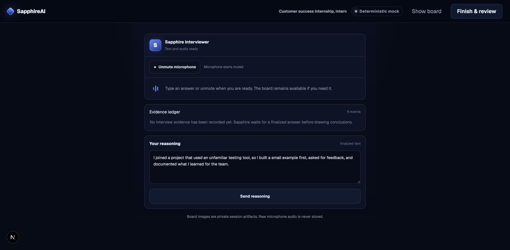
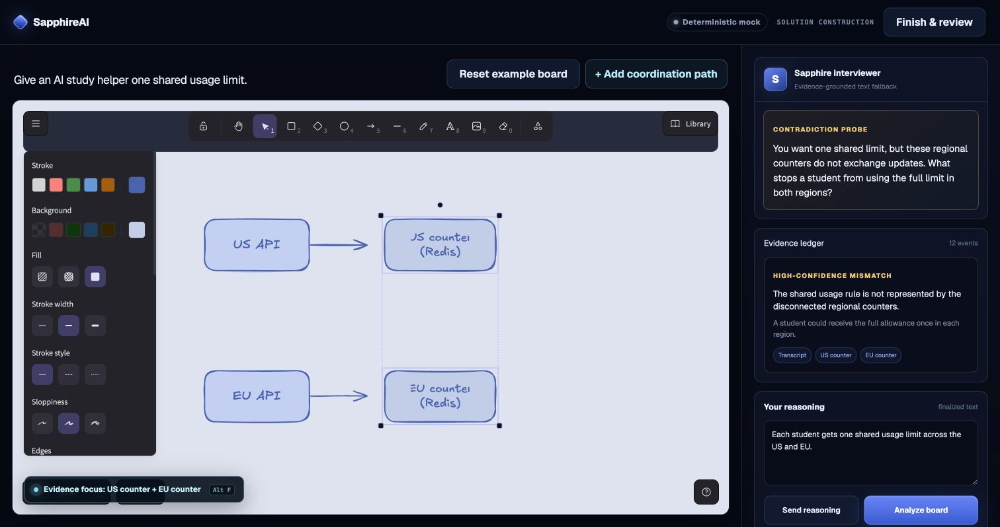
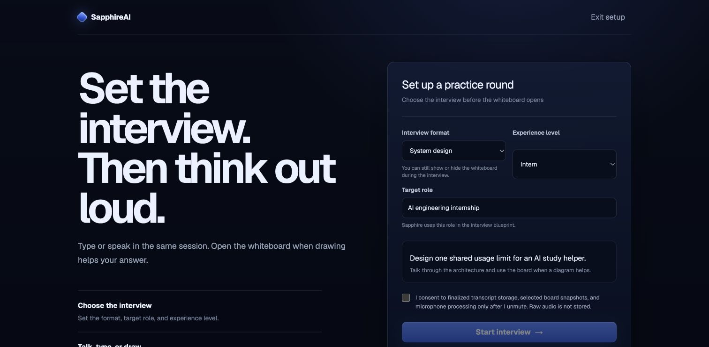
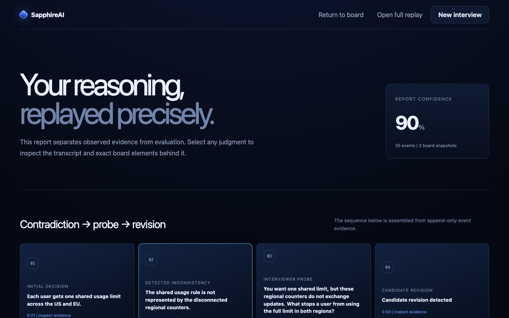
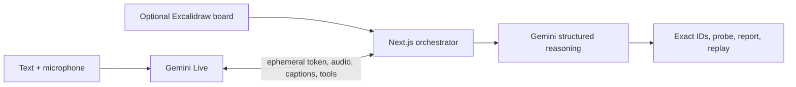

# SapphireAI

SapphireAI is a multimodal interview practice app. Type or speak in the same session, open the whiteboard when it helps, and get follow-up questions grounded in what you actually said and drew.

Voice is the default conversation mode, but the microphone starts muted. Sapphire introduces the role naturally and reads interviewer turns aloud while keeping their transcript in chat; users can still type, speak, or switch to a quiet text conversation. In local mock mode, supported browsers provide speech-to-text and read-aloud without Gemini credentials. Raw microphone audio is not stored by SapphireAI.

## Where it helps

| Interview | Example | Whiteboard |
| --- | --- | --- |
| System design | Design a shared API quota for an AI study app | Useful for architecture and data flow |
| Technical explanation | Explain how you would evaluate an AI assistant | Optional for metrics or a test plan |
| Case study | Reduce support response time without lowering quality | Optional for a workflow or decision tree |
| Behavioral | Describe learning an unfamiliar tool quickly | Usually hidden so the conversation stays central |

<table>
  <tr>
    <td width="50%">
      
      <br><sub><strong>Conversation first:</strong> type or unmute without choosing a mode before the interview.</sub>
    </td>
    <td width="50%">
      
      <br><sub><strong>Board when useful:</strong> the interviewer cites the exact elements behind a contradiction.</sub>
    </td>
  </tr>
</table>

## The product loop

1. Choose the interview type, enter any target role, and set the experience level.
2. Answer with text, microphone audio, or both.
3. Show or hide the Excalidraw whiteboard at any point.
4. After a meaningful board edit pauses, Sapphire compares finalized transcript evidence with stable board elements.
5. Review the question, revision, report, and board replay.

<table>
  <tr>
    <td width="50%">
      
      <br><sub>One setup for system design, technical, case, and behavioral practice.</sub>
    </td>
    <td width="50%">
      
      <br><sub>The final report links judgments back to observable evidence.</sub>
    </td>
  </tr>
</table>

## Flagship demo

The deterministic acceptance test uses an AI engineering internship prompt:

- The candidate says every student gets one shared limit across the US and EU.
- The board shows separate regional counters with no coordination path.
- Sapphire highlights only those counters and asks what prevents double use.
- The candidate adds a global coordination path.
- Sapphire recognizes the revision and preserves the full sequence in the report.

This sequence works without Gemini credentials in mock mode and is covered by Playwright.

## Run locally

Requirements: Node.js 24 LTS, pnpm 11, and a Chromium-based browser.

```bash
pnpm install
cp .env.example .env.local
pnpm dev
```

Open [http://localhost:3000](http://localhost:3000).

Mock mode is the safest way to try the complete whiteboard flow:

```dotenv
GEMINI_MODE=mock
ENABLE_GEMINI_LIVE=false
ENABLE_FIRESTORE=false
ENABLE_CLOUD_STORAGE=false
APP_BASE_URL=http://localhost:3000
SESSION_SIGNING_SECRET=replace-with-at-least-32-random-characters
```

It needs no cloud account, billing, API key, or Google Cloud credit.

In supported Chrome-family browsers, **Unmute microphone** uses the browser speech service and **Hear question** reads the current interviewer turn aloud. This free local fallback is separate from native Gemini Live audio.

## Enable Gemini Live

Real mode keeps the permanent Gemini credential on the server. The browser receives a short-lived, one-use ephemeral token.

```dotenv
GEMINI_API_KEY=your-server-side-key
GEMINI_REASONING_MODEL=gemini-3.5-flash
GEMINI_LIVE_MODEL=gemini-3.1-flash-live-preview
GEMINI_MODE=real
ENABLE_GEMINI_LIVE=true
```

The browser sends typed turns or little-endian 16 kHz PCM microphone chunks. Gemini Live returns 24 kHz audio and finalized input/output captions. Pausing the microphone ends the audio stream but keeps text available.

Gemini Live is a Preview API and Free Tier capacity can return `429`. Do not add billing or top up just to run the local mock demo. See [Gemini usage](docs/GEMINI_USAGE.md) for the verified request shapes and current limitations.

## Architecture



Application code owns consent, session state, stable board IDs, schema validation, persistence, focus rendering, and deletion. Provider code stays behind real and deterministic mock gateways.

## Verify

```bash
pnpm lint
pnpm typecheck
pnpm test
pnpm test:e2e
pnpm build
pnpm audit --prod --audit-level high
```

The automated suite covers schemas, audio conversion, state transitions, board diffs, unknown-ID rejection, API security, the contradiction sequence, report, replay, and deletion.

## Boundaries

SapphireAI evaluates observable interview artifacts only. It does not infer personality, emotion, accent quality, facial expression, protected traits, private chain of thought, or culture fit. It does not make hiring decisions.

The MVP excludes resumes, job matching, accounts, payments, employer dashboards, and generic chat.

## Documentation

- [Implementation plan](docs/IMPLEMENTATION_PLAN.md)
- [Architecture](docs/ARCHITECTURE.md)
- [Gemini usage](docs/GEMINI_USAGE.md)
- [Google Cloud runbook](docs/GOOGLE_CLOUD.md)
- [Privacy](docs/PRIVACY.md)
- [QA report](docs/QA_REPORT.md)

Apache-2.0 licensed. See [LICENSE](LICENSE).
